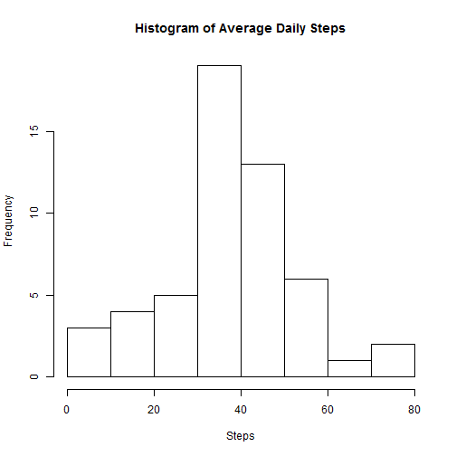
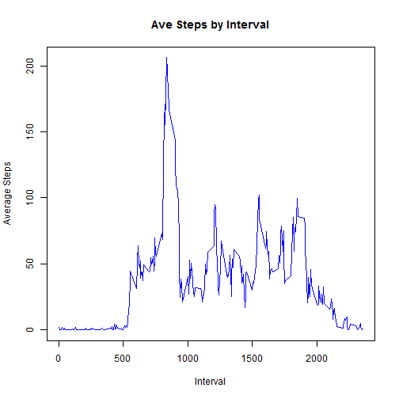
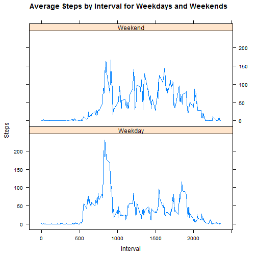

## Reproducible Research: Peer Assessment 1
### Loading and preprocessing the data

The first step in the analysis is to load the data into R and take a look at it.
After examining the basic properties of the file we can move on to cleaning or
modifying the dataset if necessary. We assume data has been downloaded to a
data folder.

A more complete solution would check for the folder and data and if not found
create the folder and attempt to download the data.


```r
# set the correct working directory
# we assume data is already downloaded into a data folder

getwd()
```

```
## [1] "C:/StatWare/Rprog/RepData/RepData_PeerAssessment1"
```

```r
setwd("C:/StatWare/Rprog/RepData/RepData_PeerAssessment1")

actdata <- read.csv("C:/StatWare/Rprog/RepData/RepData_PeerAssessment1/data/activity.csv")

# check the basic properties of the data, missing value check is shown below

head(actdata)
```

```
##   steps       date interval
## 1    NA 2012-10-01        0
## 2    NA 2012-10-01        5
## 3    NA 2012-10-01       10
## 4    NA 2012-10-01       15
## 5    NA 2012-10-01       20
## 6    NA 2012-10-01       25
```

```r
tail(actdata)
```

```
##       steps       date interval
## 17563    NA 2012-11-30     2330
## 17564    NA 2012-11-30     2335
## 17565    NA 2012-11-30     2340
## 17566    NA 2012-11-30     2345
## 17567    NA 2012-11-30     2350
## 17568    NA 2012-11-30     2355
```

```r
str(actdata)
```

```
## 'data.frame':	17568 obs. of  3 variables:
##  $ steps   : int  NA NA NA NA NA NA NA NA NA NA ...
##  $ date    : Factor w/ 61 levels "2012-10-01","2012-10-02",..: 1 1 1 1 1 1 1 1 1 1 ...
##  $ interval: int  0 5 10 15 20 25 30 35 40 45 ...
```

```r
summary(actdata)
```

```
##      steps                date          interval     
##  Min.   :  0.00   2012-10-01:  288   Min.   :   0.0  
##  1st Qu.:  0.00   2012-10-02:  288   1st Qu.: 588.8  
##  Median :  0.00   2012-10-03:  288   Median :1177.5  
##  Mean   : 37.38   2012-10-04:  288   Mean   :1177.5  
##  3rd Qu.: 12.00   2012-10-05:  288   3rd Qu.:1766.2  
##  Max.   :806.00   2012-10-06:  288   Max.   :2355.0  
##  NA's   :2304     (Other)   :15840
```

### What is mean total number of steps taken per day?

For this section we are asked to plot a histogram of the mean number of steps
per day. In addition, compute the mean and median steps per day. First we 
look at a histogram of the data "as-is" from the summary() we have the mean
and median of steps for the raw dataset.


```r
actdata2 <- actdata[!is.na(actdata$steps),]
summary(actdata2)
```

```
##      steps                date          interval     
##  Min.   :  0.00   2012-10-02:  288   Min.   :   0.0  
##  1st Qu.:  0.00   2012-10-03:  288   1st Qu.: 588.8  
##  Median :  0.00   2012-10-04:  288   Median :1177.5  
##  Mean   : 37.38   2012-10-05:  288   Mean   :1177.5  
##  3rd Qu.: 12.00   2012-10-06:  288   3rd Qu.:1766.2  
##  Max.   :806.00   2012-10-07:  288   Max.   :2355.0  
##                   (Other)   :13536
```

```r
dailymean <- aggregate(actdata2$steps, by=list(actdata2$date), mean)

# mean and median after removing NA
mean(dailymean$x)
```

```
## [1] 37.3826
```

```r
median(dailymean$x)
```

```
## [1] 37.37847
```


```r
hist(dailymean$x, xlab="Steps", main=paste("Histogram of Average Daily Steps"))
```

 

The histogram above gives us a quick visual of the spread in the data. The mean is about 37.4 steps.

 
### What is the average daily activity pattern?

This section requests a time series plot of average steps over the daily intervals.


```r
# steps by interval, interval with max steps

intmean <- aggregate(actdata2$steps, by=list(actdata2$interval), mean)
head(intmean)
```

```
##   Group.1         x
## 1       0 1.7169811
## 2       5 0.3396226
## 3      10 0.1320755
## 4      15 0.1509434
## 5      20 0.0754717
## 6      25 2.0943396
```

```r
plot(intmean$Group.1, intmean$x, type="l", xlab = "Interval", ylab = "Average Steps", col="blue", main="Ave Steps by Interval")
```

 

```r
# simpliest way of finding the interval - look at the max
summary(intmean)
```

```
##     Group.1             x          
##  Min.   :   0.0   Min.   :  0.000  
##  1st Qu.: 588.8   1st Qu.:  2.486  
##  Median :1177.5   Median : 34.113  
##  Mean   :1177.5   Mean   : 37.383  
##  3rd Qu.:1766.2   3rd Qu.: 52.835  
##  Max.   :2355.0   Max.   :206.170
```

```r
intmean[intmean$x>=100,] #interval 835 is the one
```

```
##     Group.1        x
## 99      810 129.4340
## 100     815 157.5283
## 101     820 171.1509
## 102     825 155.3962
## 103     830 177.3019
## 104     835 206.1698
## 105     840 195.9245
## 106     845 179.5660
## 107     850 183.3962
## 108     855 167.0189
## 109     900 143.4528
## 110     905 124.0377
## 111     910 109.1132
## 112     915 108.1132
## 113     920 103.7170
## 191    1550 102.1132
```

### Imputing missing values

Check for which columns have missing values.


```r
sum(is.na(actdata$steps))
```

```
## [1] 2304
```

```r
sum(!is.na(actdata$steps))
```

```
## [1] 15264
```

```r
sum(is.na(actdata$date))
```

```
## [1] 0
```

```r
sum(!is.na(actdata$date))
```

```
## [1] 17568
```

```r
sum(is.na(actdata$interval))
```

```
## [1] 0
```

```r
sum(!is.na(actdata$interval))
```

```
## [1] 17568
```

We note that only the steps column is missing data and since we have seen in the histogram that
there is potentially an impact to our study due to the missing values. There are many approaches.
For the entire assignment we are attempting to take a simple base R approach. We look at the means
by day and by interval as well as some of the medians.


```r
intmed <- aggregate(actdata2$steps, by=list(actdata2$interval), median)

#aggregated by interval
summary(intmean)
```

```
##     Group.1             x          
##  Min.   :   0.0   Min.   :  0.000  
##  1st Qu.: 588.8   1st Qu.:  2.486  
##  Median :1177.5   Median : 34.113  
##  Mean   :1177.5   Mean   : 37.383  
##  3rd Qu.:1766.2   3rd Qu.: 52.835  
##  Max.   :2355.0   Max.   :206.170
```

```r
summary(intmed)
```

```
##     Group.1             x         
##  Min.   :   0.0   Min.   : 0.000  
##  1st Qu.: 588.8   1st Qu.: 0.000  
##  Median :1177.5   Median : 0.000  
##  Mean   :1177.5   Mean   : 3.962  
##  3rd Qu.:1766.2   3rd Qu.: 0.000  
##  Max.   :2355.0   Max.   :60.000
```

```r
#aggregated by day
summary(dailymean)
```

```
##        Group.1         x          
##  2012-10-02: 1   Min.   : 0.1424  
##  2012-10-03: 1   1st Qu.:30.6979  
##  2012-10-04: 1   Median :37.3785  
##  2012-10-05: 1   Mean   :37.3826  
##  2012-10-06: 1   3rd Qu.:46.1597  
##  2012-10-07: 1   Max.   :73.5903  
##  (Other)   :47
```

```r
# substitute interval mean steps for missing values
actdata$newsteps <- ifelse(is.na(actdata$steps),
                              intmean$x, actdata$steps)

summary(actdata)
```

```
##      steps                date          interval         newsteps     
##  Min.   :  0.00   2012-10-01:  288   Min.   :   0.0   Min.   :  0.00  
##  1st Qu.:  0.00   2012-10-02:  288   1st Qu.: 588.8   1st Qu.:  0.00  
##  Median :  0.00   2012-10-03:  288   Median :1177.5   Median :  0.00  
##  Mean   : 37.38   2012-10-04:  288   Mean   :1177.5   Mean   : 37.38  
##  3rd Qu.: 12.00   2012-10-05:  288   3rd Qu.:1766.2   3rd Qu.: 27.00  
##  Max.   :806.00   2012-10-06:  288   Max.   :2355.0   Max.   :806.00  
##  NA's   :2304     (Other)   :15840
```

We select the interval means to use to substitute for the missing data. This helps preserve 
variability that gets lost in selecting medians at the cost of potentially overstating values. 
Using the daily mean would amplify the issues in using a mean in the first place. Note that
we preserve the overall mean as well (37.38).

### Are there differences in activity patterns between weekdays and weekends?

The assignment asks to plot the overall averages by interval for weedays and weekends on separate plots in
a panel. For ease we use the lattice package like the sample plot. In order to smooth the data we aggregate
by interval and the weekend or weekday variable. This helps us to see the pattern that weekends show a
greater amount of activity overall compared to weekdays but that weekays have a considerable amount of
activity in the early intervals.


```r
actdata$weekday <- weekdays(as.POSIXlt(actdata$date))
actdata$daycat <- ifelse(actdata$weekday %in% c("Saturday","Sunday"), "Weekend", "Weekday")

library(lattice)

newdailymean <- aggregate(actdata$newsteps, by=list(actdata$interval, actdata$daycat), mean)
head(newdailymean)
```

```
##   Group.1 Group.2          x
## 1       0 Weekday 2.25115304
## 2       5 Weekday 0.44528302
## 3      10 Weekday 0.17316562
## 4      15 Weekday 0.19790356
## 5      20 Weekday 0.09895178
## 6      25 Weekday 1.59035639
```

```r
xyplot(x ~ Group.1 | Group.2 , data=newdailymean, type="l", layout=c(1,2), xlab="Interval", ylab="Steps", main=paste("Average Steps by Interval for Weekdays and Weekends"))
```

 

### This section is for assignment submission

We are directed to use knitr but with the command and not RStudio GUI

```r
#library(knitr)
#knit2html("PA1_template.Rmd","PA1_template.html")
```

